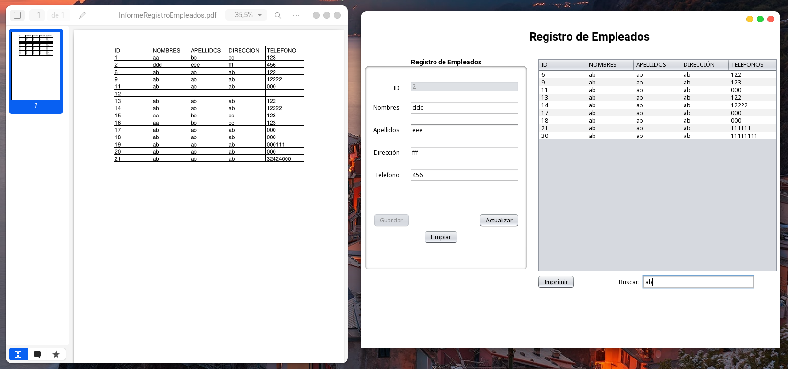

# CRUD en Java y MySQL fácil

Video: 'https://www.udemy.com/course/crud-en-java-y-mysql-facil/learn/lecture/23580202#content' \

Herramientas: XAMPP, Netbeans IDE 17\
BD: driver MySQL, Motor: MariaDB -> db1 \
JAVA: openjdk 17.06.6 \
Querys de la BD disponibles en *.../sql/* /

## Applicación

- Nombre: CRUD-Java
- Framework: Maven
- Tipo: app de escritorio
- GUI: Java Swing
- Complemeto: itextPDF

## Funcionalidades

1. Aplicación Maven de escritorio con Java Swing
2. Permite buscar por nombre y apellido
3. Integración con BD
4. Uso de Almacenamientos Almacenados
5. Conexión a la BD y querys desacopladas del main
6. Implementa manejo de excepciones de manera basica
7. Permite imprimir la tabla de empleados a PDF con cuadro de navegador de archivos
8. Permite actualizar registro seleccionado
9. Permite borrar un registro seleccionado
10. EL boton de guardar se deshabilita al seleccionar algun registro
